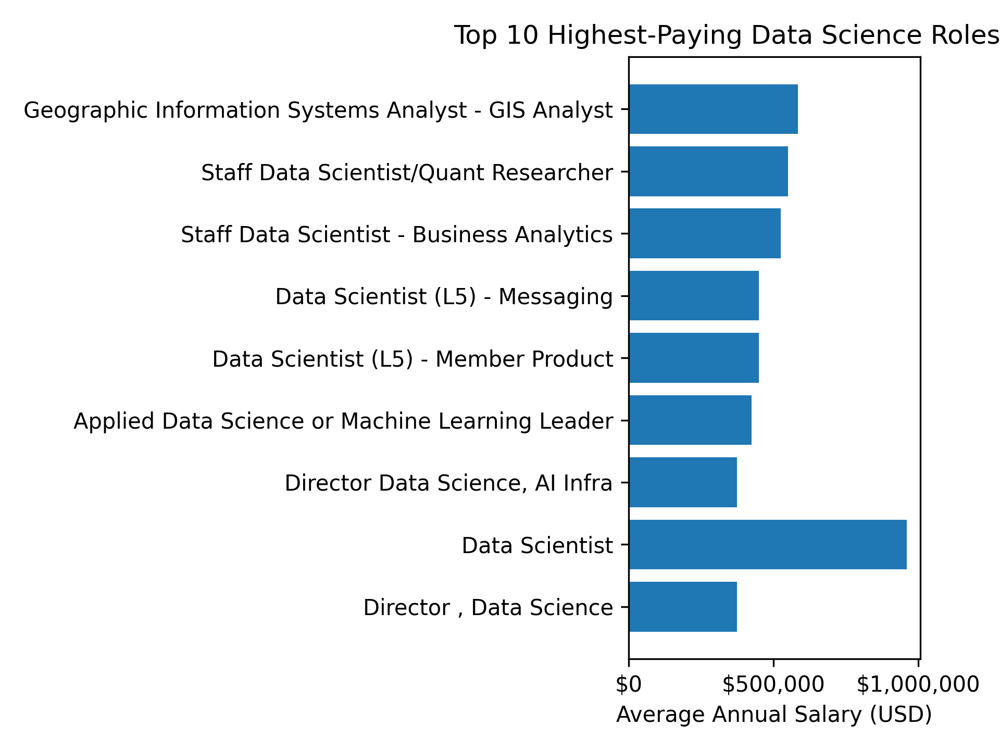
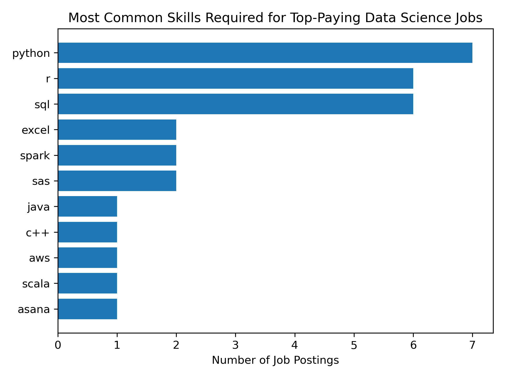

# Introduction
Dive into the data job market as it was in 2023! Focusing on data scientist roles, this project explores top-paying jobs, in-demand skills, and where high demand meets high salary in data science.

SQL queries? Check them out here: [project_sql folder](/project_sql/)

# Background
Driven by a quest to navigate the data science job market more effectively, this project was born from a desire to pinpoint top-paid and in-demand skills to find optimal jobs.

Data hails from [SQL for Data Analytics](https://lukebarousse.com/sql). It's packed with insights on job titles, salaries, locations, and essential skills.

## Questions for this project:

1. What are the top-paying data scientist jobs?
2. What skills are required for these top-paying jobs?
3. What skills are most in-demand for data science?
4. Which skills are associated with higher salaries?
5. What are the most optimal skills to learn?

# Tools I Used
For this deep dive into the data science job market as it was in 2023, I harnessed several key tools:

- **SQL:** The backbone of my analysis, allowing me to query the database and unearth critical insights.

- **PostgreSQL:** The chosen database management system, ideal for handling the job posting data.

- **Visual Studio Code:** My go-to for database management and executing SQL queries.

- **Git & GitHub:** Essential for version control and sharing my SQL scripts and analysis, ensuring project tracking.

# Analysis
Each query for this project aimed at investigating specific aspects of the data science job market. Here's how I approached each question:

### 1. Top Paying Data Analyst Jobs
To identify the highest-paying roles, I filtered data scientist positions by average yearly salary. This query highlights the high paying opportunities in the field.

```sql
SELECT
    job_id,
    job_title,
    job_location,
    job_schedule_type,
    salary_year_avg,
    job_posted_date,
    name AS company_name
FROM
    job_postings_fact
LEFT JOIN company_dim ON job_postings_fact.company_id = company_dim.company_id
WHERE
    job_title_short = 'Data Scientist' AND
    salary_year_avg IS NOT NULL
ORDER BY
    salary_year_avg DESC
LIMIT 10;
```


*Bar graph visualizing the top 10 salaries for Data Scientist roles.*

Here's the breakdown of the top data science positions from 2023:
- **Data Skewed:** The data is significantly skewed with one position far exceeding the rest.
- **Seniority:** The roles with the highest pay are more senior and leadership roles.
- **Role Type:** Most of the highest paying roles are specialized, not just with the title of Data Scientist.

### 2. Skills for Top Paying Data Analyst Jobs
To understand what skills are required for these top-paying positions, I joined the job postings with the skills data. This highlighted what employers value for high-paying roles.

```sql
WITH top_paying_jobs AS (
    SELECT
        job_id,
        job_title,
        salary_year_avg,
        name AS company_name
    FROM
        job_postings_fact
    LEFT JOIN company_dim ON job_postings_fact.company_id = company_dim.company_id
    WHERE
        job_title_short = 'Data Scientist' AND
        salary_year_avg IS NOT NULL
    ORDER BY
        salary_year_avg DESC
    LIMIT 10
)

SELECT
    top_paying_jobs.*,
    skills
FROM top_paying_jobs
INNER JOIN skills_job_dim ON top_paying_jobs.job_id = skills_job_dim.job_id
INNER JOIN skills_dim ON skills_job_dim.skill_id = skills_dim.skill_id
ORDER BY
    salary_year_avg DESC;
```


*Bar graph visualizing the skills required for the top 10 Data Scientist roles.*

Here's the breakdown of the most in-demand skills for the top Data Scientist positions in 2023:

- **Python** is leading with 7 of the 10 positions requiring it.
- **SQL and R** are tied just behind python, each required for 6 positions.

### 3. In-Demand Skills for Data Science

This query helped identify the skills most frequently requested in job postings, directing focus to areas with high demand.

```sql
SELECT
    skills,
    COUNT(skills_job_dim.job_id) AS demand_count
FROM job_postings_fact
INNER JOIN skills_job_dim ON job_postings_fact.job_id = skills_job_dim.job_id
INNER JOIN skills_dim ON skills_job_dim.skill_id = skills_dim.skill_id
WHERE
    job_title_short = 'Data Scientist'
GROUP BY
    skills
ORDER BY
    demand_count DESC
LIMIT 5;
```

| Skill   | Demand Count |
| ------- | ------------ |
| Python  | 114,016      |
| SQL     | 79,174       |
| R       | 59,754       |
| SAS     | 29,642       |
| Tableau | 29,513       |

*Table of the top 5 in-demand skills for Data Science positions.*

**Python** and **SQL** dominate data science job postings, appearing in significantly more roles than other analytical and visualization tools.

### 4. Skills Based on Salary

Here, we explored the average salaries associated with different skills revealing which skills are the highest paying.

```sql
SELECT
    skills,
    ROUND(AVG(salary_year_avg), 0) AS avg_salary
FROM job_postings_fact
INNER JOIN skills_job_dim ON job_postings_fact.job_id = skills_job_dim.job_id
INNER JOIN skills_dim ON skills_job_dim.skill_id = skills_dim.skill_id
WHERE
    job_title_short = 'Data Scientist'
    AND salary_year_avg IS NOT NULL
GROUP BY
    skills
ORDER BY
    avg_salary DESC
LIMIT 10;
```

| Skill         | Average Salary (USD) |
| ------------- | -------------------- |
| Asana         | $215,477             |
| Airtable      | $201,143             |
| Red Hat       | $189,500             |
| Watson        | $187,417             |
| Elixir        | $170,824             |
| Lua           | $170,500             |
| Slack         | $168,219             |
| Solidity      | $166,980             |
| Ruby on Rails | $166,500             |
| R Shiny       | $166,436             |

*Table of the average salaries of the top-paying skills for Data Science roles.*

The highest-paying skills are often specialized or niche tools rather than the most widely demanded ones. This suggests that compensation increases with scarcity and domain-specific expertise, even when overall demand is lower.

### 5. Most Optimal Skills to Learn

Combining insights from demand and salary data, this query aimed to pinpoint skills that are both high-demand and have high salaries, offering a strategic focus for skill development.

```sql
SELECT
    skills_dim.skill_id,
    skills_dim.skills,
    COUNT(skills_job_dim.job_id) AS demand_count,
    ROUND(AVG(job_postings_fact.salary_year_avg), 0) AS avg_salary
FROM job_postings_fact
INNER JOIN skills_job_dim ON job_postings_fact.job_id = skills_job_dim.job_id
INNER JOIN skills_dim ON skills_job_dim.skill_id = skills_dim.skill_id
WHERE
    job_title_short = 'Data Scientist'
    AND salary_year_avg IS NOT NULL
GROUP BY
    skills_dim.skill_id
HAVING
    COUNT(skills_job_dim.job_id) > 20
ORDER BY
    avg_salary DESC,
    demand_count DESC
LIMIT 10;
```

| Skill     | Demand Count | Average Salary (USD) |
| --------- | ------------ | -------------------- |
| Neo4j     | 32           | $163,971             |
| Airflow   | 144          | $155,878             |
| Theano    | 25           | $153,133             |
| BigQuery  | 135          | $149,292             |
| Atlassian | 23           | $148,715             |
| Express   | 89           | $148,333             |
| Looker    | 186          | $147,538             |
| Go        | 316          | $147,466             |
| PyTorch   | 564          | $145,989             |
| Scala     | 381          | $145,056             |

*Table of the most optimal skills to learn as a Data Scientist sorted by salary then demand.*

Skills that combine strong demand with above-average salaries tend to be infrastructure, orchestration, or scalable analytics tools. These skills often support production-grade data systems rather than purely exploratory analysis.

# What I Learned

This project helped me go from an SQL novice, to having a better equipped SQL toolkit. Here are some of the skills I have gained from this experience:

- **Creating Complex Queries:** I became comfortable with more advanced SQL techniques like subqueries and CTEs.
- **Data Aggregation:** I became more familiar with GROUP BY and turned aggregate functions like COUNT() and AVG() into important data-summarizing tools.
- **Asking Good Questions:** I built on my real-world problem-solving skills, turning questions into actionable, insightful SQL queries.

# Conclusions

## Insights
From my analysis, I gained some valuable insights into the Data Science job market as it was in 2023:

1. **Top-Paying Data Scientist Jobs:** Excluding the outlier, the highest paying jobs for Data Scientist center around ~$500,000.

2. **Skills for Top-Paying Jobs:** Python, SQL, and R are the top 3 skills required for the 10 top-paying Data Science jobs, making them some of the most critical skills for earning a top salary.

3. **Most In-Demand Skills:** Those same skills are the top 3 in-demand skills for all Data Science Positions included in this dataset, making them essential for job-seekers.

4. **Skills with High Salaries:** Specialized skills, such as Asana and Airtable, are associated with the highest salaries. This indicates that more scarce skills are more highly valued.

5. **Optimal Skills for Job Market Value:** PyTorch stands out as a high-demand and high paying skill for data scientists to learn to maximize their market value.